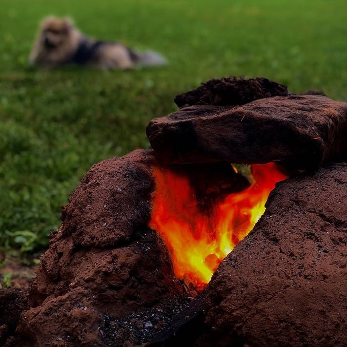

Posts written in the CMS are plain Markdown. Paragraphs, headings, lists, links and blockquotes all render with the same styling as the older MDX posts.

## Images

A paragraph containing just one image becomes a captioned figure — the alt text is the caption:

Several images in one paragraph become a row. Paths can be copied straight from the CMS media browser:

 

> Blockquotes render as callouts.

- Bullet lists work
- and so do `inline code` and [links](https://docs.gogitcms.com).

This post is a draft, so it only shows up in `astro dev` and the CMS — not on the live site. Delete it once you've written a real one.
